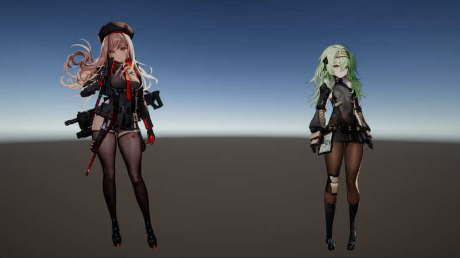

# Nikke Viewer EX

Nikke Viewer EX is an interactive tool designed for previewing characters from the game GODDESS OF VICTORY: NIKKE. This viewer allows users to engage with character models through Live 2D (Spine 2D) animations with audio, providing an immersive and dynamic experience.

## Features

- Interactable Live 2D:
  - Portraits ✅
  - Covers 🚧
  - Aiming 🚧
- Preview 3D Mesh with Animations 🚧
- Live Wallpaper Support ✅

## How to Use

1. Adding a Nikke to the Nikke List:
    - Click the **Add** button.
    - Browse and select the local assets from your device using the browse button ⬜ or enter the URL directly.
2. Setting Up Assets:
    - Skel: Select an asset or URL ending with `.skel`.
    - Atlas: Select an asset or URL ending with `.atlas`.
    - Textures: Choose assets or URLs ending with `.png`.
    - Voices (Optional): Select a directory containing audio files. Ensure the server returns JSON data or directly link to a `.json` file listing the audio file paths. Supported formats include `.mp3`, `.ogg`, `.wav`.
    - ~~Naming Your Nikke: Give your Nikke a name for easy identification.~~
3. Applying Settings:
    - Click the **Apply** button to save your settings.
4. Interacting with Nikke:
    - Move Nikke by **clicking** and **holding** with the `Left Mouse` button, then drag and drop.
    - Interact with Nikke by **clicking** with the `Left Mouse` button.
    - Toggle the main control panel visibility using the `Tab` key.

## Contributing

We welcome contributions to enhance this project! Feel free to suggest improvements, report bugs, or submit pull requests. Don't hesitate ;)

## Licenses

This project is licensed under [MIT License](./LICENSE "See LICENSE file").  
Spine Runtimes is licensed under [Spine Runtimes License Agreement](https://esotericsoftware.com/spine-runtimes-license).
